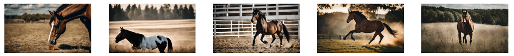
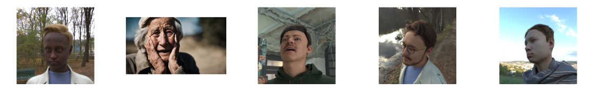
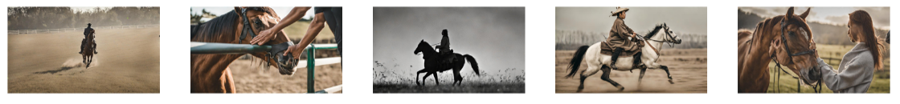
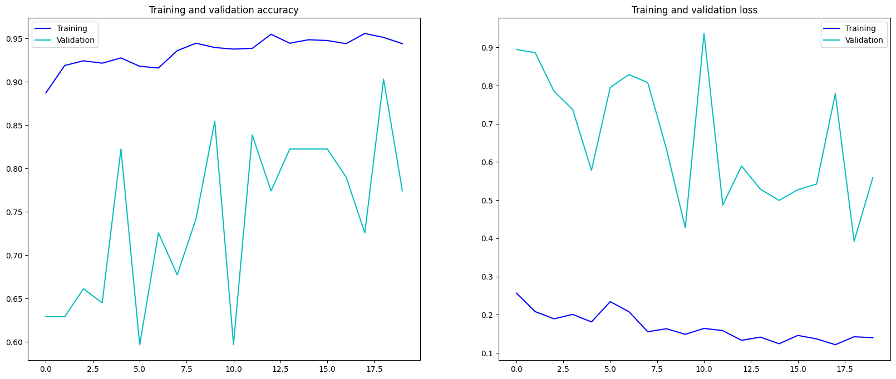
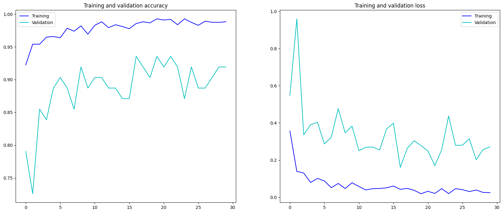

# CGI2Real Multi-Class Image Classifier

## Project Overview
The CGI2Real_Multi-Class_Image_Classifier is an image classification model designed to classify images into three categories: humans, horses, and a combination of both. It utilizes transfer learning, a popular technique in deep learning, leveraging the architecture and pre-trained weights of the Inception Convolutional Neural Network model. Trained on synthetic images, it can also classify real ones.

### Synthetic Images

  

  

  

## Project Inspiration
The inspiration for this project stemmed from Laurence Moroney's binary classifier, which was trained on synthetic images of humans and horses. Building upon this concept, I aimed to utilize a different dataset of computer-generated images and transitioned the classifier from binary to multi-class. This adaptation enabled the classification of images containing both humans and horses.

## Training Process
The training process involves fine-tuning the parameters of the Inception model on the three distinct CGI image datasets. These datasets are carefully curated and collected to represent scenarios featuring humans, horses, and both entities coexisting within the same image. The decision to use CGI images instead of real images stems from the practical challenges associated with acquiring large volumes of real data, particularly in scenarios involving specific subjects like horses. While real images offer authenticity, the synthetic nature of CGI images provides scalability and flexibility, enabling the creation of diverse training sets without constraints.

## Model's Performance
The model's performance metrics are highly promising, with a training accuracy of 99% indicating its proficiency in learning from the training data. Furthermore, the validation accuracy of 92% underscores its ability to generalize well to unseen data, demonstrating robust classification capabilities. Despite the impressive results, there remains room for improvement, particularly in the exploration of integrating real images into the training pipeline. Future iterations of the model could benefit from hybrid approaches that combine synthetic and real data, potentially enhancing its adaptability to real-world scenarios and further improving classification accuracy.

### Performance Evaluation: Base Model vs. Model fine-tuned with Inception Convolutional Neural Network
<table>
  <tr>
    <td style="text-align: center;">
      
Base Model with Transfer Learning

      
    </td>
    <td style="text-align: center;">
      
Model fine-tuned with Inception V3

      
    </td>
  </tr>
</table>

## Data Sources:
- Synthetic images for humans, horses, and combinations were generated through https://runwayml.com/.
- Additional synthetic images specifically for humans were downloaded from: [facesyntheticspubwedata.blob.core.windows.net/iccv-2021/dataset_100000.zip](https://facesyntheticspubwedata.blob.core.windows.net/iccv-2021/dataset_1000.zip).

## Model and Weights for Usage
The finalized model and its weights are available for free download and unrestricted use.

## License:
This project is licensed under the Raza Mehar License. See the LICENSE.md file for details.

## Contact:
For any questions or clarifications, please contact Raza Mehar at [raza.mehar@gmail.com].
